<h1>Android to Ignition SCADA Sensor Gateway</h1>

> A full-stack Industrial IoT (IIoT) proof-of-concept. This project captures real-time sensor data from an Android device, transmits it via MQTT, processes it in Ignition SCADA, and visualizes it on a live web dashboard.

```mermaid
flowchart TD
    A[📱 Android Device<br>Kotlin App] -->|Publishes JSON Sensor Data<br>Topics: Pixel6a/sensor/x, /y, /z| B[🖥️ Mosquitto MQTT Broker<br>Hosted on local PC]
    B -->|MQTT Engine subscribes<br>with Wildcard Topics| C[⚙️ Ignition SCADA<br>MQTT Engine Module]
    C -->|Creates & Updates<br>Memory Tags| D[🏷️ Ignition Tag Provider]
    D -->|Binds Tags to<br>Web Dashboard| E[🌐 Ignition Perspective<br>Web Module]
    D -->|Logs Data| F[💾 MariaDB Database]
    E -->|Serves Responsive UI| G[🖥️ Web Browser<br>Live Monitoring]
```

<h2>Architecture</h2>

<h2>Demo</h2>

<a>http://localhost:8088/data/perspective/client/Ignition_Android</a>

If my pc is running then the link should work :)

 
      
    <em>A short videos showing the Android app, MQTT messages flowing, and the live dashboard updating in real-time.</em> 

<h2>What I've Tried</h2>
<h3>From Android to Ignition</h3>
<strong>MQTT Engine Setup Challenges</strong>: The initial setup of the MQTT Engine module was the biggest hurdle. The critical breakthrough was understanding where to configure so that the module could listen for the broker. I figured out that it was to make a custom namespace.

<strong>Custom Namespaces</strong>: By defining subscriptions to Pixel6a/+/x, Pixel6a/+/y, and Pixel6a/+/z, the module automatically creates and updates the necessary tags upon receiving the first message, streamlining the entire process.

<h3>From Ignition to a Website</h3>

<strong>WebDev Module as a REST API</strong>: As a creative workaround, I built a Python script within the WebDev module to expose the SQL database history as a JSON API endpoint. This worked but introduced complexity with CORS headers and was ultimately an extra step not needed for the core MQTT functionality.

<h2>Android Process in Detail</h2>

The app uses the SensorManager to get a reference to the device's accelerometer and gyroscope hardware. It registers a SensorEventListener to receive updates on the onSensorChanged() function, the sensor values (x, y, z) are packaged into a simple JSON object for each sensor type. Using the Eclipse Paho MQTT client library, it establishes a connection to the Mosquitto broker running on my local PC and publishes the JSON strings to the respective topics (e.g., Pixel6a/accelerometer/x).

<h2 >Broker Process in Detail</h2>

Eclipse Mosquitto is a popular open-source MQTT broker, it acts as a central message bus, decoupling the Android publisher from the Ignition subscriber. It was installed on my Windows PC on the local network. The broker runs on the default port 1883. And after setting it up with my environmental variables

<h2>MQTT Engine Process in Detail</h2>
It is configured as a client to connect to the Mosquitto broker using the server's local IP address. It uses wildcard topics (+) to subscribe to a pattern: Pixel6a/+/x, Pixel6a/+/y, Pixel6a/+/z. This allows it to listen for messages from any sensor (accelerometer, gyroscope) on any axis. Upon receiving a message on a new topic, the MQTT Engine automatically creates a corresponding Memory tag. Every new MQTT message that arrives on a topic immediately updates the value of its associated tag in Ignition, providing real-time data flow.

<h2 >Ignition Process in Detail</h2>
The tags created by the MQTT Engine are configured to enable logging. This means every value change is timestamped and stored in the connected MariaDB database for historical trending and analysis. Perspective components like charts, gauges, and labels are bound to the tags created by the MQTT Engine. Ignition's built-in web server serves the project to any user with a web browser, providing a and real-time view of the sensor data.

<footer style="
    background_color=#333333;
    position: fixed;
    bottom: 0;
    width: 100%;
    padding=16px;"><strong>Author:</strong> Michael Cardoso  <strong>License:</strong> This project is licensed under the MIT License. 
</footer>

